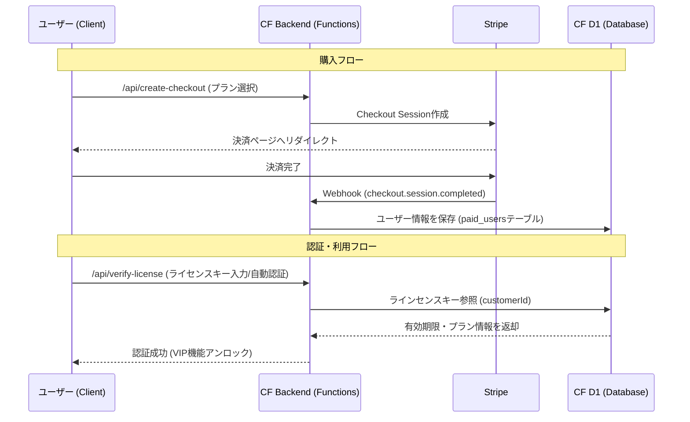

# Stripe VIP機能 実装ドキュメント

このドキュメントは、EzStampifyにおけるStripe決済およびVIP機能管理の実装詳細、アーキテクチャ、運用方法をまとめたものです。

## 1. アーキテクチャ概要

本プロジェクトでは、認証サーバーやメールサーバーを持たず、**StripeのCustomer ID**を認証キーとして利用し、**Cloudflare D1**で権限管理を行うサーバーレスアーキテクチャを採用しています。

### システム構成図



## 2. バックエンド実装 (Cloudflare Pages Functions)

すべてのAPIエンドポイントは `functions/api/` 配下に配置されています。

| ファイル             | エンドポイント         | 説明                                                                                      |
| :------------------- | :--------------------- | :---------------------------------------------------------------------------------------- |
| `create-checkout.ts` | `/api/create-checkout` | Stripe決済セッションを作成。`customerId`がある場合は引き継いで既存顧客として処理。        |
| `webhook.ts`         | `/api/webhook`         | Stripeからのイベントを受信し、D1データベースを更新。署名検証によるセキュリティ確保済み。  |
| `verify-license.ts`  | `/api/verify-license`  | クライアントから送信されたライセンスキー（Customer ID）を検証。IPベースのレート制限付き。 |
| `get-customer.ts`    | `/api/get-customer`    | 決済完了後のセッションIDからCustomer IDを取得し、自動ログインを実現（DBも参照）。         |
| `create-portal.ts`   | `/api/create-portal`   | Stripeカスタマーポータル（解約・カード変更画面）へのリンクを生成。                        |

### データベーススキーマ (D1: `paid_users`)

```sql
CREATE TABLE paid_users (
  id TEXT PRIMARY KEY,        -- Stripe Customer ID (例: cus_...)
  email TEXT,                 -- 連絡用メールアドレス
  subscription_id TEXT,       -- 月額プランの場合のSubscription ID
  plan_type TEXT,             -- 'subscription' または 'onetime'
  created_at INTEGER,         -- 作成日時 (Unix Timestamp)
  updated_at INTEGER          -- 更新日時
);
```

## 3. フロントエンド実装 (`VipAuthModal.tsx`)

VIP機能の紹介、プラン選択、購入、ライセンス認証、管理を一元管理するモーダルコンポーネントです。

### 主な機能

1.  **プラン選択と法的確認の統合**:
    - 月額プラン（Gem💎）と買い切りプラン（Infinity♾️）を横並びで表示。
    - 各カード内に「更新・解約条件」「返金ポリシー」を明記。
    - **特定商取引法対応**: 「利用規約・プライバシーポリシー」への同意チェックボックスを必須化し、チェックがないと決済へ進めない制御を実装。
2.  **動的なUI制御**:
    - プラン選択時は画面幅を広げ（`max-w-2xl`）、比較しやすく自動調整。
    - 認証済みユーザーには「アップグレード」や「契約管理」ボタンを動的に表示。
3.  **自動移行（アップグレード）**:
    - 月額ユーザーが買い切りプランを購入する場合、既存のCustomer IDを引き継ぎます。

## 4. 自動解約・プラン移行ロジック

月額プラン加入者が「買い切りプラン」を購入した場合、ユーザーの手間を省くために自動的に移行処理が行われます。

1.  **購入検知**: Webhookが `checkout.session.completed` (mode: payment) を受信。
2.  **既存契約確認**: DBを参照し、同一Customer IDで有効な `subscription_id` があるか確認。
3.  **自動解約**: Stripe API (`stripe.subscriptions.cancel`) を叩いて既存サブスクを即時解約。
4.  **ステータス更新**: DBの `plan_type` を `onetime` に更新し、以後永続ライセンスとして扱います。

## 5. 環境変数・設定

プロジェクトのルートにある `.dev.vars` (ローカル) および Cloudflare Pages設定 (本番) で管理します。

| 変数名                         | 説明                                      |
| :----------------------------- | :---------------------------------------- |
| `STRIPE_PUBLISHABLE_KEY`       | 公開鍵 (`pk_...`)。フロントエンドで使用。 |
| `STRIPE_SECRET_KEY`            | 秘密鍵 (`sk_...`)。サーバーサイドで使用。 |
| `STRIPE_WEBHOOK_SECRET`        | Webhook署名検証用 (`whsec_...`)。         |
| `STRIPE_PRICE_ID_SUBSCRIPTION` | 月額プランの価格ID (`price_...`)。        |
| `STRIPE_PRICE_ID_ONETIME`      | 買い切りプランの価格ID (`price_...`)。    |

## 6. 管理・運用

### ライセンスキーの確認方法

ユーザーがキーを紛失した場合：

1.  Stripeダッシュボードの「顧客」ページを開く。
2.  メールアドレスで検索。
3.  `cus_` で始まる **顧客ID** がそのままライセンスキーになります。

### 商用リリース手順

詳細な手順は別ファイル `RELEASE_CHECKLIST.md` を参照してください。
